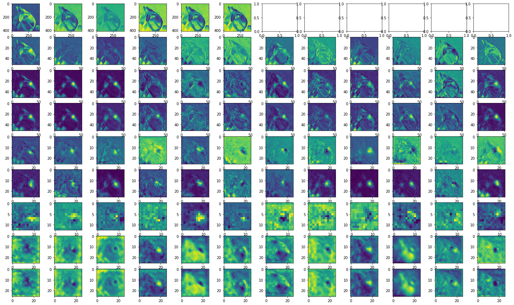

# YOLO Object Detection Algorithm Training and Evaluating Pipeline

## Requirement:
1. System: Window. Linux and mac not supported (This is because the kernel and libraries in `requirements.txt` are specialized to window)
2. Dataset:
 * Card dataset: [https://www.kaggle.com/luantm/playing-card](https://cocodataset.org/#download)
 * COCO dataset: [https://cocodataset.org/#download](https://cocodataset.org/#download)
 * Other dataset can be found [here](https://public.roboflow.com/object-detection):
   * 
3. VS Code (in order to run the jupyter notebook with python file: VS Code format)

## File structure:
* `yolo`: Contains the core library of the algorithm.
  * `__init__.py`
  * `const.py`: Storing hyper params.
  * `loss.py`: Collection of loss functions
  * `model.py`: Collection of YOLO model and base conv model.
  * `utils.py`: Utillities methods.
* `main_card_ds.py`: This is the jupyter notebook (vscode format) to train the YOLO v1 algorithm on the solitare card detection dataset.
* `main_coco_ds.py`: This is the jupyter notebook (vscode format) to train the YOLO v1 algorithm on the coco object detection dataset.
* `main_coco_ds.ipynb`: This is the jupyter notebook to train the YOLO v1 algorithm on the coco object detection dataset **on Google Colab (Training elsewhere will not work as expected)**.
* `weights`: contains the weights file
  * `checkpoint9`: The yolo v3 model with customization. Train for 2 epochs and 20000 step each epoch, with batch size 4.
  * `checkpoint10`: The yolo v3 model with customization. Train for 4 epochs and 20000 step each epoch, with batch size 4.

## Run the training process:

* First, install the required libraries: 
```
conda create -n tf
conda activate tf
pip install -r requirements.txt
```
* Next, go into one python file `main_card_ds.py` or `main_coco_ds.py` and experiment with the VS Code notebook.

* Alternatively, you can go to this colab notebook to see the training pipeline: [https://colab.research.google.com/drive/1YamrFLBJ1K7Dmy7L3f7hLp0LeNaBFL4Y?usp=sharing](https://colab.research.google.com/drive/1YamrFLBJ1K7Dmy7L3f7hLp0LeNaBFL4Y?usp=sharing). Remember to change the runtime type to GPU if you want to run the whole pipeline

## Example:
* Here is the intermediary outputs in the convolution layers:
  

## Reference:
```
@INPROCEEDINGS{7780460,
author={Redmon, Joseph and Divvala, Santosh and Girshick, Ross and Farhadi, Ali},
booktitle={2016 IEEE Conference on Computer Vision and Pattern Recognition (CVPR)}, 
title={You Only Look Once: Unified, Real-Time Object Detection}, 
year={2016},
volume={},
number={},
pages={779-788},
doi={10.1109/CVPR.2016.91}}
```

* https://jonathan-hui.medium.com/real-time-object-detection-with-yolo-yolov2-28b1b93e2088